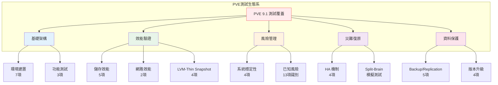

# PVE測試計劃書 - 摘要與目標

## 摘要與基本資訊 (Document Information)

本計劃書由系統服務處主導，旨在驗證 Proxmox VE v9.1 在生產環境中的可行性 。

#### **測試標的**：Proxmox VE v9.1
#### **主測單位**：系統服務處 平台服務部 虛擬化架構課
#### **協測單位**：系統服務處 基礎架構部 網路架構課
#### **主測同仁**：Tony / Andy
#### **測試期間**：2026/01/20 - 2026/09/30
#### **最後更新**：2026-03-20

---

## 測試說明與目標 (Test Objectives)

此計畫書用於佐證並確認實體設備或虛擬平台在硬體上線前，其功能與效能均符合要求 。

* **假想敵對標**：預設 **VMware VCF 8.0u3** 為競爭對手，確認 PVE 9.1 能否符合實際營運情境的功能需求 。

* **數據真實度**：採用 PVE 9.1 原生系統測試官方各類數據與效能，確保其可信度 。

* **SOP 規劃**：針對各種事故狀況規劃排除方式，建立未來營運使用的標準作業程序 。

---

### 測試類別總覽 (Test Categories Overview)

本測試計畫涵蓋以下七大測試類別：

| 測試類別 | 測試代號前綴 | 測試項目數 | 主要驗證目標 |
|----------|--------------|------------|--------------|
| 環境建置測試 | TC-ENV | 7 項 | 軟硬體安裝、叢集部署 |
| 功能測試 | TC-FUNC | 3 項 | LVM、LACP 網路功能 |
| 系統穩定性測試 | TC-SYS | 4 項 | Kernel、記憶體穩定度 |
| HA/災難復原測試 | TC-HA | 4 項 | Corosync、HA 機制驗證 |
| 儲存與網路測試 | TC-ST / TC-NW | 7 項 | 效能基準、風險驗證 |
| Backup/Replication 測試 | TC-BR | 5 項 | PBS 整合、備份還原 |
| LVM-Thin Snapshot 測試 | TC-LVMSP | 4 項 | Snapshot 建立/還原/效能 |
| 版本升級測試 | TC-UPG | 4 項 | 8→9 升級、回滾演練 |
| **總計** | - | **41 項** | - |

---

### 測試覆蓋範圍 (Test Coverage Scope)

---

### 關鍵風險驗證重點 (Key Risk Validation Focus)

本測試計畫特別關注以下已知問題：

| 風險 ID | 風險描述 | 驗證方式 | 優先順序 |
|---------|----------|----------|----------|
| R-001 | Kernel 6.8 Freeze | TC-SYS-01~03 長期壓測 | P1 |
| R-003 | LVM-Thin 空間耗盡 | TC-ST-03 空間壓力測試 | P1 |
| R-007 | LACP 觸發 HA 誤動作 | TC-HA-02 單鏈路故障 | P1 |
| R-009 | Corosync Split-Brain | TC-HA-03 網路隔離測試 | P1 |
| R-010 | HA 敏感度過高 | TC-HA-01 Corosync 參數調校 | P1 |
| R-004 | QCOW2 效能低落 | TC-ST-04 FIO 效能對比 | P2 |

---

## 名詞定義

* **實體設備**：計畫用於正式環境運營之硬體 。
* **虛擬平台**：計畫用於正式環境運營之虛擬化軟體架構 。
* **PROD**：正式運營環境 (Production) 。
* **STAGING**：進入 PROD 前的最終測試環境，包含但不限於 UAT 。
* **UAT**：使用者驗收測試，包含但不限於需求單位、工程開發等 。
* **PBS (Proxmox Backup Server)**：PVE 原生備份解決方案，支援增量備份與 client-side deduplication 。
* **pmxcfs**：Proxmox Cluster File System，用於 `/etc/pve` 設定檔同步 。
* **Corosync**：叢集通訊引擎，負責節點間心跳與 quorum 管理 。
* **LVM-Thin**：邏輯卷管理器 thin provisioning，支援精簡配置 。
* **RTO (Recovery Time Objective)**：系統從故障中恢復的目標時間 。
* **SOP (Standard Operating Procedure)**：標準作業程序 。

