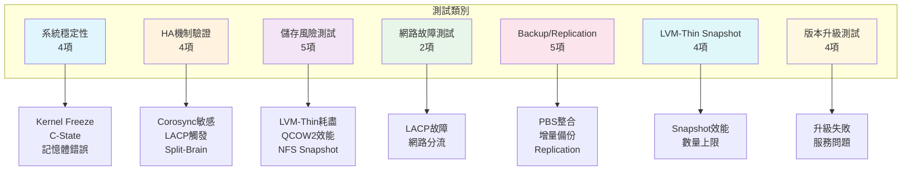

# PVE測試計劃書 - 測試計劃表補充案

> 本文件為 `PVE測試計劃書` 之補充內容，專注於風險驗證、已知問題測試、Backup/Replication、LVM-Thin Snapshot 及版本升級測試。

---

## 風險驗證測試矩陣 (Risk-Based Test Matrices)

### 3.x 系統穩定性測試 (System Stability Tests)

| 項次 | 測試代號 | 測試項目 | 驗證項目 | 方法 | 預期結果 | 測試員 | 備註 |
|------|----------|----------|----------|------|----------|--------|------|
| 3.1 | TC-SYS-01 | Kernel 版本穩定性驗證 | Kernel 6.8 freeze 問題 | 長時間 stress test (48h)，監控 `vmstat 1`、`dmesg -w` | 確認 freeze 發生條件與 kernel 版本關聯性 | Tony | 需準備 iDRAC/IPMI 作為 fallback 連線 |
| 3.2 | TC-SYS-02 | Kernel 降級驗證 | 降級至 kernel 6.5 LTS 穩定性 | 切換預設 kernel，重啟後驗證 VM 正常運行 | VM 運行穩定，無 I/O 異常 | Tony | 比較 6.5 vs 6.8 效能差異 |
| 3.3 | TC-SYS-03 | CPU C-State 穩定性 | `max_cstate=1` 參數效果 | 修改 GRUB 參數，長時間觀察主機穩定性 | 主機無 freeze，效能損失可接受 (< 5%) | Tony | 需與硬體供應商確認支援性 |
| 3.4 | TC-SYS-04 | 記憶體錯誤檢測 | ECC/非ECC 記憶體穩定度 | `mcelog`、`edac-util` 檢查記憶體錯誤 | 無記憶體錯誤拋出，VM 運行正常 | Tony | 確認 Dell R640 iDRAC 日誌 |

### 3.x HA 機制驗證測試 (High Availability Mechanism Tests)

| 項次 | 測試代號 | 測試項目 | 驗證項目 | 方法 | 預期結果 | 測試員 | 備註 |
|------|----------|----------|----------|------|----------|--------|------|
| 3.5 | TC-HA-01 | Corosync 敏感度測試 | 網路延遲導致 HA 誤觸發 | 使用 `tc` 注入 500ms 延遲，觀察 corosync 行為 | 驗證 `deadtime`、`token` 參數調整效果 | Tony | 需關閉防火牆或開啟對應 port |
| 3.6 | TC-HA-02 | LACP 單鏈路故障 HA 觸發 | 非聚合網路斷線觸發 HA | 實體拔除或 `ip link set down` 其中一條 Bond 成員 | 確認 Corosync 能否容忍單鏈路故障不觸發 HA | Tony | 為已知敏感問題，優先測試 |
| 3.7 | TC-HA-03 | Corosync Split-Brain 模擬 | 節點隔離後的 quorum 行為 | `iptables -A INPUT -s <node_ip> -j DROP` 阻斷通訊 | 無 quorum 節點進入唯讀模式，不發生資料不一致 | Tony | 需準備快速恢復腳本 |
| 3.8 | TC-HA-04 | HA Manager Lock 遷移 | 服務重啟後的資源鎖定 | `systemctl restart pve-ha-crm`，檢查 `ha-manager status` | Lock 平滑遷移，VM 無非預期重啟 | Tony | 需驗證 fencing 机制 |

### 3.x 儲存風險測試 (Storage Risk Tests)

| 項次 | 測試代號 | 測試項目 | 驗證項目 | 方法 | 預期結果 | 測試員 | 備註 |
|------|----------|----------|----------|------|----------|--------|------|
| 3.9 | TC-ST-03 | LVM-Thin Pool 空間耗盡 | Metadata 空間對 I/O 影響 | 持續寫入直到 thin pool 達 95%，觀察 I/O 行 | 達到閾值前預警，不發生 VM 凍住 | Tony | 高風險測試，需 snapshot 保護 |
| 3.10 | TC-ST-04 | QCOW2 vs RAW 效能差異 | 儲存格式對 I/O 效能影響 | FIO 測試相同條件下 QCOW2 與 RAW 的 IOPS | 量化效能損耗比例 (預期 30-90%) | Tony | 有助於決策儲存格式 |
| 3.11 | TC-ST-05 | NFS Snapshot 作業時間 | NFS 環境 QCOW2 Snapshot 延遲 | 建立 50GB VM 的 QCOW2 snapshot，計時 | 驗證 snapshot 建立時間是否符合 SLA (< 5min) | Tony | 已知問題：可能 > 15min |
| 3.12 | TC-ST-06 | LVM-Thin Snapshot 效能影響 | Snapshot 數量對 I/O 影響 | 建立 5 個 LVM-Thin snapshot，執行 FIO 測試 | 驗證 snapshot 數量對效能的衰減程度 | Tony | 僅測試 LVM-Thin VM |
| 3.13 | TC-ST-07 | RAID 6 雙碟故障容錯 | 硬碟雙故障後的資料完整性 | 模擬 RAID 6 雙碟故障，執行 MD5 校驗 | 資料一致性 100%，重建時間可接受 | Tony | 高風險，需 NetApp 快照 |

### 3.x 網路故障測試 (Network Failure Tests)

| 項次 | 測試代號 | 測試項目 | 驗證項目 | 方法 | 預期結果 | 測試員 | 備註 |
|------|----------|----------|----------|------|----------|--------|------|
| 3.14 | TC-NW-02 | LACP 故障轉移時間 | Bond 成員故障後的切換時間 | 中斷單一鏈路，測量網路中斷時間 | 切換時間 < 1 秒，丟包 < 3 個 | Tony | 需驗證 switch 端 LACP 設定 |
| 3.15 | TC-NW-03 | 管理網路與 Corosync 網路分離 | 網路分流的穩定性 | 將 Corosync 流量移至專用網段 | HA 切換穩定，不因管理網路波動觸發 | Tony | 建議最佳實踐 |

### 3.x PVE 內建 Backup 與 Replication 測試 (Backup & Replication Tests)

| 項次 | 測試代號 | 測試項目 | 驗證項目 | 方法 | 預期結果 | 測試員 | 備註 |
|------|----------|----------|----------|------|----------|--------|------|
| 3.16 | TC-BR-01 | Proxmox Backup Server (PBS) 整合 | PBS 與 PVE 9.1 整合度 | 安裝 PBS，配置 datastore，掛載至 PVE 儲存 | 成功新增 PBS 儲存類型，無認證錯誤 | Tony | 需獨立伺服器或 VM |
| 3.17 | TC-BR-02 | VM 增量備份驗證 | 增量備份機制正確性 | 建立 VM，執行首次完整備份，修改資料後執行增量 | 增量備份大小合理 (預期 < 5% 總大小) | Tony | 驗證 client-side deduplication |
| 3.18 | TC-BR-03 | VM 備份還原驗證 | 備份還原完整性 | 備份 VM，刪除 VM，執行完整還原 | VM 完整還原，包含所有設定與資料 | Tony | 需驗證資料一致性 |
| 3.19 | TC-BR-04 | VM Replication 跨節點複製 | ZFS/LVM-Thin 複製機制 | 配置 VM replication job，執行跨節點複製 | VM 在目標節點成功啟動，資料一致 | Tony | 不需要 PBS，純本地複製 |
| 3.20 | TC-BR-05 | 備份工作排程驗證 | 自動化備份排程正確性 | 設定每日備份排程，驗證執行時間與日誌 | 備份按排程執行，日誌無錯誤 | Tony | 需長時間觀察 |

### 3.x LVM-Thin Snapshot 專項測試 (LVM-Thin Snapshot Tests - Only)

> **注意**：本區塊僅針對 LVM-Thin 格式的 VM，QCOW2 VM 不在本測試範圍。

| 項次 | 測試代號 | 測試項目 | 驗證項目 | 方法 | 預期結果 | 測試員 | 備註 |
|------|----------|----------|----------|------|----------|--------|------|
| 3.21 | TC-LVMSP-01 | LVM-Thin Snapshot 建立 | Snapshot 建立速度與可行性 | 對 LVM-Thin VM 建立線上 snapshot | Snapshot 建立成功，VM 不中斷 | Tony | 需確認 VM 磁碟為 LVM-Thin |
| 3.22 | TC-LVMSP-02 | LVM-Thin Snapshot 還原 | Snapshot 還原正確性 | 建立 snapshot，寫入資料，還原至 snapshot 點 | 資料正確還原，VM 正常啟動 | Tony | 驗證資料一致性 |
| 3.23 | TC-LVMSP-03 | LVM-Thin Snapshot 刪除 | Snapshot 刪除對效能影響 | 刪除多個 snapshot，觀察 I/O 變化 | 刪除過程不影響 VM 運行 | Tony | 需注意刪除順序 |
| 3.24 | TC-LVMSP-04 | LVM-Thin Snapshot 數量上限 | Snapshot 數量對效能影響 | 建立 10 個 snapshot，執行 FIO 測試 | 找出效能明顯衰減的臨界點 | Tony | 建議不超過 5 個 |

### 3.x PVE 版本升級測試 (Upgrade Tests)

| 項次 | 測試代號 | 測試項目 | 驗證項目 | 方法 | 預期結果 | 測試員 | 備註 |
|------|----------|----------|----------|------|----------|--------|------|
| 3.25 | TC-UPG-01 | PVE 8 → 9 離線升級 | 離線升級流程正確性 | 參考官方文件，執行離線升級流程 | 升級成功，無服務中斷，VM 正常運行 | Tony | 需先在測試環境驗證 |
| 3.26 | TC-UPG-02 | 升級後服務啟動驗證 | 核心服務正常運行 | 檢查 `pve-cluster`, `pve-firewall`, `pve-ha-lrm` 狀態 | 所有核心服務正常啟動，無錯誤日誌 | Tony | 需比對 `/var/log/pve-manager/` |
| 3.27 | TC-UPG-03 | 升級後 VM 運行驗證 | VM 不受升級影響 | 啟動所有 VM，驗證網路、儲存、I/O | VM 運行正常，效能無明顯差異 | Tony | 需執行效能基準測試 |
| 3.28 | TC-UPG-04 | 升級回滾演練 | 升級失敗的復原能力 | 備份後執行升級，模擬失敗，手動回滾 | 成功回滾至升級前狀態 | Tony | 需練習完整流程 |

---

## 測試矩陣摘要 (Test Matrix Summary)

| 測試類別 | 項目數 | 覆蓋風險 |
|----------|--------|----------|
| 系統穩定性測試 | 4 | Kernel Freeze、C-State、記憶體 |
| HA 機制驗證測試 | 4 | Corosync 敏感、LACP、Split-Brain |
| 儲存風險測試 | 5 | LVM-Thin、QCOW2、NFS、RAID |
| 網路故障測試 | 2 | LACP、網路分流 |
| Backup & Replication | 5 | PBS、備份還原、Replication |
| LVM-Thin Snapshot | 4 | Snapshot 建立/還原/刪除/數量上限 |
| 版本升級測試 | 4 | 離線升級、服務驗證、回滾 |
| **總計** | **28** | - |

---

## 測試矩陣視覺化 (Test Coverage Overview)

---

## 測試前置條件 (Prerequisites)

1. **環境隔離**：測試環境與 PROD/STAGING 完全隔離
2. **資料快照**：重要測試前需建立 NetApp 快照
3. **iDRAC 存取**：確保所有節點的 iDRAC 可連線
4. **文件備份**：`/etc/pve`、`/etc/pve/corosync.conf` 需完整備份
5. **還原方案**：每次高風險測試前需準備 Rollback 方案

---

## 測試時程建議 (Timeline Recommendations)

| 測試階段 | 預估天數 | 測試項目 |
|----------|----------|----------|
| Phase 1: 系統穩定性 | 3 天 | TC-SYS-01 ~ TC-SYS-04 |
| Phase 2: HA 機制 | 5 天 | TC-HA-01 ~ TC-HA-04 |
| Phase 3: 儲存風險 | 4 天 | TC-ST-03 ~ TC-ST-07 |
| Phase 4: 網路故障 | 2 天 | TC-NW-02 ~ TC-NW-03 |
| Phase 5: Backup/Replication | 5 天 | TC-BR-01 ~ TC-BR-05 |
| Phase 6: LVM-Thin Snapshot | 3 天 | TC-LVMSP-01 ~ TC-LVMSP-04 |
| Phase 7: 版本升級 | 4 天 | TC-UPG-01 ~ TC-UPG-04 |
| **總計** | **26 天** | - |

