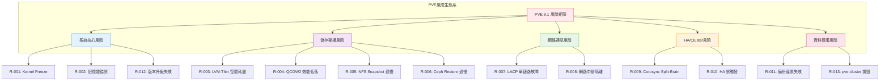
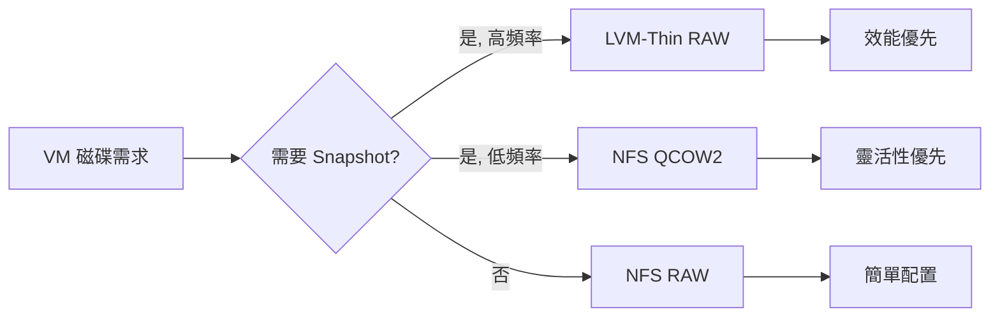
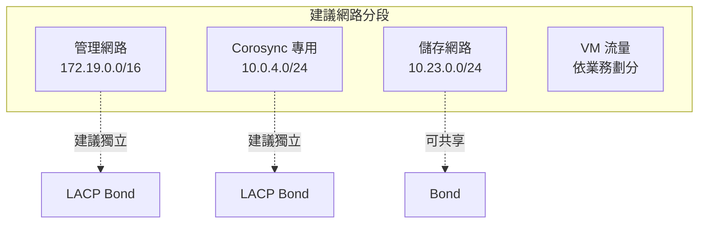
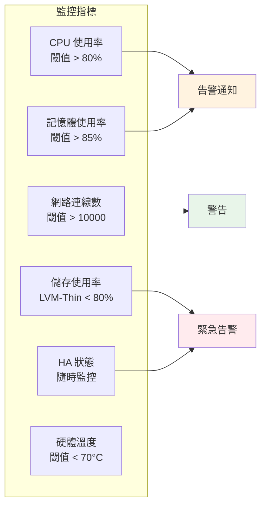
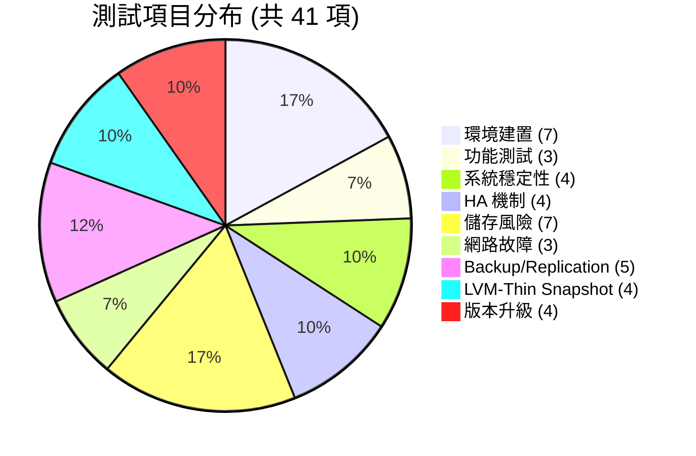

# PVE風險評估矩陣 (Risk Assessment Matrix)

> 本矩陣整合網路搜尋之 Proxmox VE 已知問題，分門別類並提供補救 SOP。

---

## 風險分類總覽 (Risk Classification Overview)



---

## 風險評估矩陣 (Risk Assessment Matrix)

| 風險 ID | 風險描述 | 發生機率 | 影響程度 | 風險指數 | 優先順序 | 相關測試 |
|---------|----------|----------|----------|----------|----------|----------|
| R-001 | Kernel 6.8 Freeze 導致系統無回應 | 中 | 高 | 高 | P1 | TC-SYS-01 |
| R-002 | 記憶體錯誤導致 VM 崩潰 | 低 | 高 | 中 | P2 | TC-SYS-04 |
| R-003 | LVM-Thin Pool Metadata 空間耗盡 | 中 | 高 | 高 | P1 | TC-ST-03 |
| R-004 | QCOW2 格式導致 30-90% 效能損耗 | 高 | 中 | 中 | P2 | TC-ST-04 |
| R-005 | NFS Snapshot 作業時間過長 (>15min) | 高 | 中 | 中 | P2 | TC-ST-05 |
| R-006 | Ceph RBD Restore 速度過慢 | 中 | 中 | 中 | P3 | TC-APP-01 |
| R-007 | LACP 單鏈路故障觸發 HA 切換 | 高 | 高 | 高 | P1 | TC-HA-02 |
| R-008 | 網路中斷導致節點隔離 | 中 | 高 | 高 | P1 | TC-NW-03 |
| R-009 | Corosync Split-Brain 導致資料不一致 | 中 | 高 | 高 | P1 | TC-HA-03 |
| R-010 | HA 過於敏感導致非預期 VM 重啟 | 高 | 高 | 高 | P1 | TC-HA-01 |
| R-011 | 備份還原失敗導致資料遺失 | 低 | 高 | 中 | P2 | TC-BR-03 |
| R-012 | 版本升級失敗需要回滾 | 中 | 中 | 中 | P2 | TC-UPG-04 |
| R-013 | pve-cluster/pmxcfs 資料庫損毀 | 低 | 高 | 中 | P2 | TC-SVC-03 |

**風險指數計算**：發生機率 × 影響程度 (高=3, 中=2, 低=1)

---

## 詳細風險 SOP 手冊 (Risk SOP Handbook)

---

### R-001: Kernel 6.8 Freeze 風險處置 SOP

**風險分類**：系統核心風險  
**觸發徵兆**：
- SSH 無回應
- Web UI 無法連線
- `ping` 有回應但無服務
- iDRAC 可正常連線

**立即處置流程**：

```bash
# Step 1: 透過 iDRAC/IPMI 強制重啟
ipmitool -I lanplus -H <iDRAC_IP> -U <user> -P <pass> power reset

# Step 2: 重啟後檢查 kernel 版本
uname -r

# Step 3: 列出可用 kernel
ls /boot/vmlinuz-*

# Step 4: 設定預設 kernel 為 6.5 LTS
pve-efiboot-tool kernel list
pve-efiboot-tool kernel set 0

# Step 5: 驗證設定
cat /etc/default/pve-efiboot-tool
```

**根本預防設定**：

```bash
# 方法一：停用問題 kernel
echo "0" > /sys/kernel/mm/hugepages/hugepages-2048kB/nr_hugepages  # 測試用

# 方法二：設定 GRUB 參數
vim /etc/default/grub
# 加入：GRUB_CMDLINE_LINUX="processor.max_cstate=1"
update-grub
reboot

# 方法三：移除問題 kernel
apt remove pve-kernel-6.8*
```

**相關連結**：
- [Thomas-Krenn Known Issues](https://www.thomas-krenn.com/en/wiki/Known_Issues_Proxmox_VE)
- [Proxmox Kernel Forum](https://forum.proxmox.com/tags/kernel/)

---

### R-002: 記憶體錯誤檢測 SOP

**風險分類**：系統核心風險  
**觸發徵兆**：
- `dmesg | grep -i "memory"` 出現錯誤
- VM 偶發性崩潰
- `mcelog` 有錯誤記錄

**診斷流程**：

```bash
# Step 1: 檢查 mcelog
mcelog --client
mcelog --machine-readable

# Step 2: 檢查 EDAC (記憶體錯誤偵測)
edac-util -v

# Step 3: 檢查 Dell iDRAC 日誌
ipmitool -I lanplus -H <iDRAC_IP> -U <user> -P <pass> sel list

# Step 4: 記憶體壓力測試
memtester 4096M 1
```

**Dell R640 特定檢查**：

```bash
# 透過 IPMI 檢查記憶體狀態
ipmitool -I lanplus -H <iDRAC_IP> -U <user> -P <pass> raw 0x30 0x03 0x0a 0x09 0x00

# 查看記憶體映射
dmidecode -t memory
```

---

### R-003: LVM-Thin Pool 空間耗盡 SOP

**風險分類**：儲存架構風險  
**觸發徵兆**：
- `pvesm status` 顯示 local-lvm 使用率 100%
- VM I/O 凍住
- 備份任務失敗
- `/var/log/syslog` 出現 `lvmetad` 錯誤

**緊急處置流程**：

```bash
# Step 1: 確認 thin pool 狀態
lvs -o lv_name,data_percent,metadata_percent pve

# Step 2: 確認哪些 VM/CT 佔用空間
for vm in $(qm list | tail -n +2 | awk '{print $1}'); do
    echo "VM $vm: $(qemu-img info /dev/pve/vm-$vm-disk-0 2>/dev/null | grep 'virtual size')"
done

# Step 3: 刪除不需要的 snapshot
lvs -a | grep snap
lvremove pve/vm-XXX-snap

# Step 4: 嘗試壓縮 thin pool (如有必要)
fstrim /mnt/pve/storage

# Step 5: 擴充 thin pool (如有可用空間)
lvextend -L +50G pve/data
```

**預防監控設定**：

```bash
# 建立監控 script
cat > /usr/local/bin/check-thin-pool.sh << 'EOF'
#!/bin/bash
THRESHOLD=80
THIN=$(lvs -o data_percent --noheadings pve/data | tr -d ' ')
if (( $(echo "$THIN > $THRESHOLD" | bc -l) )); then
    echo "ALERT: LVM-Thin pool at ${THIN}%" | mail -s "PVE Storage Alert" admin@example.com
fi
EOF

chmod +x /usr/local/bin/check-thin-pool.sh

# 加入 crontab 每 15 分鐘執行
echo "*/15 * * * * /usr/local/bin/check-thin-pool.sh" >> /etc/cron.d/pve-monitoring
```

**相關連結**：
- [Proxmox LVM-Thin Wiki](https://pve.proxmox.com/wiki/Storage:_LVM_Thin)
- [LVM Thin Pool Fix Guide](https://cr0x.net/en/proxmox-local-lvm-thin-pool-fix/)

---

### R-004: QCOW2 效能低落處理 SOP

**風險分類**：儲存架構風險  
**問題說明**：
- QCOW2 格式比 RAW 效能低 30-90%
- Metadata 操作增加 I/O 延遲
- Snapshot 作業消耗額外資源

**效能優化方案**：

```bash
# Step 1: 檢查目前磁碟格式
qemu-img info /var/lib/vz/images/XXX/qemu-disk.qcow2

# Step 2: 將 QCOW2 轉換為 RAW (建議)
# 警告：需要停機
qm shutdown <vmid>
qemu-img convert -O raw /var/lib/vz/images/XXX/qemu-disk.qcow2 /var/lib/vz/images/XXX/vm-disk.raw
qm set <vmid> -scsi0 local-lvm:vm-<vmid>-disk-0,format=raw

# Step 3: 如需保留 QCOW2，建議使用外部 snapshot
# RAW for primary, QCOW2 only for snapshots
```

**格式選擇建議表**：

| 儲存後端 | 建議格式 | 原因 |
|----------|----------|------|
| LVM-Thin | RAW | 最小效能損耗 |
| ZFS | RAW/ZVOL | 原生支援 |
| NFS | QCOW2 | 支援線上 Snapshot |
| Ceph RBD | RAW | 最小效能損耗 |

**相關連結**：
- [Proxmox Storage Features](https://pve.proxmox.com/wiki/Storage)
- [QCOW2 Performance Analysis](https://kb.blockbridge.com/technote/proxmox-qcow-snapshots-on-lvm/)

---

### R-005: NFS Snapshot 作業過慢 SOP

**風險分類**：儲存架構風險  
**問題說明**：
- QCOW2 Snapshot 在 NFS 上可能需要 15 分鐘以上
- VM 在 Snapshot 期間無回應
- 影響生產環境可用性

**優化建議**：

```bash
# Step 1: 確認 NFS mount options
mount | grep nfs
# 建議 options: vers=3,soft,noatime,nodiratime,cto

# Step 2: 測試 Snapshot 作業時間
time qm snapshot <vmid> <snapshot-name>

# Step 3: 考慮使用 LVM-Thin Snapshot 替代
# (如 VM 已在 LVM-Thin)
```

**Snapshot 策略建議**：



---

### R-006: Ceph RBD Restore 過慢 SOP

**風險分類**：儲存架構風險  
**問題說明**：
- Ceph RBD 備份速度快，但還原速度極慢
- 50GB VM 還原可能需要 1 小時
- 影響 RTO

**優化方向**：

```bash
# Step 1: 檢查 Ceph 網路
ceph osd tree | grep -E 'host|net'

# Step 2: 檢查 OSD 狀態
ceph osd status

# Step 3: 調整 rbd 參數
rbd config pool set <pool> rbd_balance_sReads=true

# Step 4: 確認 pool pg_num 足夠
ceph osd pool ls detail
```

**相關連結**：
- [Ceph Performance Checks](https://cr0x.net/en/proxmox-ceph-slow-performance-checks/)
- [Proxmox Ceph Integration](https://pve.proxmox.com/wiki/Deploy_Hyper-Converged_Ceph_Cluster)

---

### R-007: LACP 單鏈路故障觸發 HA SOP

**風險分類**：網路通訊風險  
**問題說明**：
- Corosync 對網路延遲/中斷極度敏感
- 單一鏈路故障可能觸發不必要的 HA 切換
- 這是 PVE 已知敏感問題

**立即處置**：

```bash
# Step 1: 確認 HA 狀態
ha-manager status

# Step 2: 查看 corosync 狀態
corosync-cmapctl | grep members

# Step 3: 檢查網路介面狀態
ip link show
cat /proc/net/bonding/bond0

# Step 4: 調整 Corosync 參數
vim /etc/corosync/corosync.conf
# 加入：
#totem {
#    ...
#    crypto_cipher: none
#    crypto_hash: none
#    deadtime: 10   # 預設 1，建議提升
#    token: 5000    # 預設 1000ms，建議提升
#}
```

**建議網路架構**：



---

### R-008: 網路中斷導致節點隔離 SOP

**風險分類**：網路通訊風險  
**觸發徵兆**：
- `pvecm status` 顯示節點離線
- VM 仍在運行但無法管理
- Corosync 成員數減少

**處置流程**：

```bash
# Step 1: 確認網路狀態
ip addr show
ip route show
ping -c 5 <other_node_ip>

# Step 2: 檢查 iptables規則
iptables -L -n -v | grep -i drop
iptables -L -n -v | grep -i reject

# Step 3: 如為 Corosync 網路問題，檢查 UDP port
netstat -uap | grep corosync

# Step 4: 恢復網路後，等待 Quorum 恢復
pvecm expected 1
```

---

### R-009: Corosync Split-Brain 處置 SOP

**風險分類**：HA/Cluster風險  
**問題說明**：
- 網路分割導致多個節點各自形成 quorum
- 可能造成資料不一致
- VM 可能同時在多個節點運行

**預防與處置**：

```bash
# Step 1: 確認 split-brain 狀態
pvecm status
# 觀察 "Quorum:" 數值

# Step 2: 確認哪些節點有 quorum
corosync-cmapctl runtime.votequorum.definitions

# Step 3: 隔離無 quorum 的節點 (安全模式)
/etc/init.d/corosync stop
# 或
systemctl stop pve-ha-lrm

# Step 4: 恢復後重新加入
pvecm add <node_ip>
```

**預防設定**：

```bash
# 啟用 Corosync 加密
vim /etc/corosync/corosync.conf
# 加入：
#totem {
#    ...
#    crypto_cipher: aes256
#    crypto_hash: sha256
#}

# 設定 Quorum 工具
vim /etc/corosync/corosync.conf
# 加入：
#quorum {
#    provider: corosync_votequorum
#    expected_votes: 3
#    auto_tie_breaker: 1
#}
```

---

### R-010: HA 過於敏感導致非預期 VM 重啟 SOP

**風險分類**：HA/Cluster風險  
**問題說明**：
- HA 機制可能因網路波動觸發
- VM 被非預期遷移或重啟
- 影響服務可用性

**調整 Corosync 敏感度**：

```bash
# Step 1: 查看當前設定
corosync-cmapctl | grep -E 'deadtime|token'

# Step 2: 調整為較不敏感的設定
pvecm expected <number_of_nodes>
# 或編輯 /etc/corosync/corosync.conf

# Step 3: 建議參數
# deadtime: 10 (預設 1)
# token: 5000 (預設 1000)
# token_retransmits_before_loss_const: 10 (預設 4)

# Step 4: 重啟 Corosync
systemctl restart corosync

# Step 5: 驗證設定
pvecm status
```

**HA 敏感度評估表**：

| 參數 | 預設值 | 保守值 | 說明 |
|------|--------|--------|------|
| deadtime | 1s | 10s | 認定節點死亡前的等待時間 |
| token | 1000ms | 5000ms | 單一 token 循環時間 |
| token_retransmits_before_loss_const | 4 | 10 | 重傳次數後判定 loss |

---

### R-011: 備份還原失敗處置 SOP

**風險分類**：資料保護風險  
**處置流程**：

```bash
# Step 1: 檢查 PBS 狀態
pvesm status

# Step 2: 查看備份日誌
journalctl -u pvesm-backup -n 50

# Step 3: 手動執行備份測試
vzdump <vmid> --storage <storage> --mode suspend

# Step 4: 檢查還原日誌
cat /var/log/pve/tasks/active/

# Step 5: 驗證備份完整性
# 掛載備份驗證
```

**Proxmox Backup Server 整合檢查清單**：

```bash
# Step 1: 新增 PBS 儲存
pvesm add pbs <storage_id> \
    --server <pbs_ip> \
    --datastore <datastore_name> \
    --username <user>@pam \
    --password <pass> \
    --fingerprint <ssh_fingerprint>

# Step 2: 驗證連線
pvesm scan pbs <pbs_ip>

# Step 3: 設定備份排程
# 透過 Web UI: Datacenter -> Backup -> Add
```

---

### R-012: 版本升級失敗回滾 SOP

**風險分類**：系統核心風險  
**升級前準備**：

```bash
# Step 1: 完整備份
vzdump --all --storage <backup_storage> --mode suspend

# Step 2: 備份設定檔
tar -czvf /tmp/pve-config-backup.tar.gz /etc/pve
tar -czvf /etc-corosync-backup.tar.gz /etc/corosync

# Step 3: 記錄当前版本
pveversion -v

# Step 4: 建立系統快照 (如使用 ZFS)
zfs snapshot rpool/pve@pre-upgrade
```

**升級流程**：

```bash
# Step 1: 確認 repository 狀態
cat /etc/apt/sources.list.d/pve-enterprise.list
# 或使用 no-subscription:
echo "deb http://download.proxmox.com/debian/pve bookworm pve-no-subscription" > /etc/apt/sources.list.d/pve-no-subscription.list

# Step 2: 更新套件列表
apt-get update

# Step 3: 執行離線升級 (推薦)
apt-get dist-upgrade

# Step 4: 確認升級後版本
pveversion -v
```

**回滾流程**：

```bash
# Step 1: 恢復設定檔
tar -xzvf /tmp/pve-config-backup.tar.gz -C /

# Step 2: 降級套件 (如需要)
# 查看已升級套件
dpkg -l | grep pve

# Step 3: 恢復 Corosync 設定
tar -xzvf /etc-corosync-backup.tar.gz -C /

# Step 4: 重啟服務
systemctl restart pve-cluster
systemctl restart pvedaemon

# Step 5: 如使用 ZFS，恢復 snapshot
zfs rollback rpool/pve@pre-upgrade
```

**相關連結**：
- [Proxmox Upgrade Guide](https://pve.proxmox.com/wiki/Upgrade_from_8_to_9)

---

### R-013: pve-cluster/pmxcfs 損毀處置 SOP

**風險分類**：資料保護風險  
**問題說明**：
- `/etc/pve` 基於 pmxcfs (Proxmox Cluster File System)
- 資料庫損毀可能導致無法管理 VM
- VM 本身不受影響

**診斷與恢復**：

```bash
# Step 1: 檢查 pmxcfs 狀態
systemctl status pve-cluster
cat /etc/pve/.members

# Step 2: 查看錯誤日誌
journalctl -u pve-cluster --since "1 hour ago"
cat /var/log/pve-cluster/pve-cluster.log

# Step 3: 嘗試重啟服務
systemctl restart pve-cluster

# Step 4: 如仍無法恢復，檢查資料庫
ls -la /var/lib/pve-cluster/

# Step 5: 從其他節點恢復 (如有)
scp root@<other_node>:/var/lib/pve-cluster/* /var/lib/pve-cluster/

# Step 6: 完全重建 (最後手段)
rm -rf /var/lib/pve-cluster/*
systemctl restart pve-cluster
```

**預防措施**：

```bash
# 定期備份 pmxcfs 資料庫
tar -czvf /tmp/pmxcfs-backup-$(date +%Y%m%d).tar.gz /var/lib/pve-cluster/

# 設定定期備份 crontab
echo "0 2 * * * root tar -czvf /tmp/pmxcfs-backup-\$(date +\%Y\%m\%d).tar.gz /var/lib/pve-cluster/" >> /etc/cron.d/pve-backup
```

---

## 風險監控儀表板建議 (Monitoring Dashboard)



## 測試矩陣總覽 (Test Matrix Overview)

### 測試類別分布



### 風險覆蓋矩陣

| 風險類別 | 識別數量 | 對應 SOP | 測試項目數 |
|----------|----------|----------|------------|
| 系統核心 | 3 | R-001, R-002, R-012 | 8 |
| 儲存架構 | 4 | R-003, R-004, R-005, R-006 | 11 |
| 網路通訊 | 2 | R-007, R-008 | 5 |
| HA/Cluster | 2 | R-009, R-010 | 8 |
| 資料保護 | 2 | R-011, R-013 | 9 |
| **總計** | **13** | **13 SOP** | **41 測試** |

---

## 快速參考 (Quick Reference)

### 測試代號對照表

| 代號前綴 | 測試類別 | 數量 |
|----------|----------|------|
| TC-ENV (1.x) | 環境建置 | 7 |
| TC-FUNC (2.x) | 功能測試 | 3 |
| TC-SYS | 系統穩定性 | 4 |
| TC-HA | HA 機制驗證 | 4 |
| TC-ST | 儲存風險測試 | 7 |
| TC-NW | 網路故障測試 | 3 |
| TC-BR | Backup/Replication | 5 |
| TC-LVMSP | LVM-Thin Snapshot | 4 |
| TC-UPG | 版本升級測試 | 4 |

### 優先測試項目 (P1)

1. **TC-HA-02**: LACP 單鏈路故障 HA 觸發測試
2. **TC-ST-03**: LVM-Thin Pool 空間耗盡測試
3. **TC-SYS-01**: Kernel 6.8 穩定性測試
4. **TC-HA-03**: Corosync Split-Brain 模擬

### 測試環境需求

| 項目 | 說明 |
|------|------|
| 節點數 | 至少 3 節點 (建議) |
| 網路 | 管理、Corosync、儲存、VM 網路分段 |
| 儲存 | NetApp FAS2650 (NFS)、LVM-Thin |
| PBS | Proxmox Backup Server (建議) |

---

## 文件修訂歷史 (Revision History)

| 版本 | 日期 | 變更內容 | 負責人 |
|------|------|----------|--------|
| 1.0 | 2026-01-28 | 初始版本 | Tony |
| 1.1 | 2026-03-20 | 補充 28 項新測試項目、13 項風險 SOP | Tony |

---

## 聯絡窗口 (Contact)

| 角色 | 姓名 | 單位 |
|------|------|------|
| 主測同仁 | Tony | 系統服務處 平台服務部 虛擬化架構課 |
| 主測同仁 | Andy | 系統服務處 平台服務部 虛擬化架構課 |
| 協測單位 | 網路架構課 | 系統服務處 基礎架構部 |

---

**最後更新**：2026-03-20


---

## 緊急聯絡矩陣 (Emergency Contact Matrix)

| 風險等級 | 回應時間 | 處理人員 | 備援方案 |
|----------|----------|----------|----------|
| P1 (高風險) | 15 分鐘 | Tony / Andy | 聯繫 Proxmox 支援 |
| P2 (中風險) | 1 小時 | Tony | 查閱本 SOP |
| P3 (低風險) | 4 小時 | 輪值人員 | 記錄問題追蹤 |


