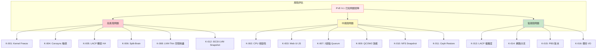

# 測試初步報告 (Preliminary Report)

### 優點 (Pros)

* **性價比高** 。
* **本地支援度高**：提供全繁體中文溝通管道 。
* **部署優勢**：安裝容易、易於管理或升級 。
* **備援完善**：HA、Snapshot、Backup 機制完整 。
* **開源彈性**：無供應商鎖定風險 。

### 缺點 (Cons)

* **文件不完整**：更新速度較慢，例如 iSCSI 最佳化組態搜尋較花時間 。
* **HA 機制缺陷**：HA 機制過於敏感，非聚合網路 (LACP) 斷線即會啟動，不如預期穩定 。
* **監測維度不足**：效能監測薄弱，無法分離 NFS 協定內各 Volume 的 IOPS 數據 。

---

## 已知問題庫 (Known Issues Database)

列舉 PVE 9.1 已知的已知問題與風險:

### 系統核心問題 (System Core Issues)

| 問題 ID | 問題描述 | 嚴重程度 | 緩解方案 | 參考來源 |
|---------|----------|----------|----------|----------|
| K-001 | Kernel 6.8 可能導致系統 freeze | 高 | 降級至 kernel 6.5 或設定 `max_cstate=1` | Thomas-Krenn Wiki |
| K-002 | 特定 CPU (AMD R5 2400GE) 與 kernel 6.14 相容性問題 | 中 | 停用 NUT 或降級 kernel | Proxmox Forum |
| K-003 | 升級後 Web UI JS 檔案缺失 (`pve-stdworkspace.js 500`) | 中 | 清除瀏覽器快取或重啟 `pveproxy` | Proxmox Forum |

### HA/Cluster 問題 (High Availability Issues)

| 問題 ID | 問題描述 | 嚴重程度 | 緩解方案 | 參考來源 |
|---------|----------|----------|----------|----------|
| K-004 | Corosync 對網路延遲極度敏感 | 高 | 調高 `deadtime` (1→10) 與 `token` (1000→5000) | Virtualization Howto |
| K-005 | LACP 單鏈路故障觸發不必要的 HA 切換 | 高 | 將 Corosync 移至專用網段 | 104 內部測試發現 |
| K-006 | Split-Brain 可能導致 VM 同時在多節點運行 | 高 | 啟用 fencing 與 quorum 設定 | Proxmox Wiki |
| K-007 | 2 節點叢集無法定義 quorum | 中 | 使用 QDevice 或加入第三節點 | Proxmox Wiki |

### 儲存問題 (Storage Issues)

| 問題 ID | 問題描述 | 嚴重程度 | 緩解方案 | 參考來源 |
|---------|----------|----------|----------|----------|
| K-008 | LVM-Thin Pool 空間耗盡導致整個 VG 鎖定 | 高 | 監控 Metadata 空間，建立預警機制 | Medium @PlanB |
| K-009 | QCOW2 格式效能比 RAW 低 30-90% | 中 | 效能優先場景使用 RAW | Blockbridge Technote |
| K-010 | NFS Snapshot 作業時間過長 (可能 > 15min) | 中 | 低頻率使用或改用 LVM-Thin Snapshot | Reddit r/Proxmox |

### 網路問題 (Network Issues)

| 問題 ID | 問題描述 | 嚴重程度 | 緩解方案 | 參考來源 |
|---------|----------|----------|----------|----------|
| K-013 | LACP 設定錯誤，易發生連線中斷 | 中 | 確認 switch 端與 PVE 端設定一致 | Proxmox Forum |
| K-014 | 管理網路與 VM 網路共享導致效能問題 | 低 | 獨立網段分流 | 建議最佳實踐 |

### 備份/還原問題 (Backup Issues)

| 問題 ID | 問題描述 | 嚴重程度 | 緩解方案 | 參考來源 |
|---------|----------|----------|----------|----------|
| K-016 | 備份任務佔用大量 I/O 影響 VM 效能 | 中 | 設定 I/O 限速或使用 `suspend` 模式 | Proxmox Wiki |

---

## 問題風險矩陣 (Issue Risk Matrix)

---

## 補救措施對照表 (Mitigation Mapping)

| 問題 ID | 對應測試代號 | 測試目標 | 驗證方式 |
|---------|--------------|----------|----------|
| K-001 | TC-SYS-01, TC-SYS-02, TC-SYS-03 | Kernel 穩定性驗證 | 長時間 stress test、降級測試 |
| K-002 | TC-SYS-04 | 記憶體/CPU 穩定性 | `mcelog`、壓力測試 |
| K-003 | TC-UPG-02 | 升級後服務驗證 | 檢查 `pveproxy` 日誌 |
| K-004 | TC-HA-01 | Corosync 敏感度 | `tc` 注入延遲測試 |
| K-005 | TC-HA-02 | LACP HA 觸發 | 單鏈路故障測試 |
| K-006 | TC-HA-03 | Split-Brain 模擬 | 網路隔離測試 |
| K-007 | TC-HA-04 | HA Lock 遷移 | 服務重啟測試 |
| K-008 | TC-ST-03 | LVM-Thin 空間耗盡 | 空間壓力測試 |
| K-009 | TC-ST-04 | QCOW2 vs RAW 效能 | FIO 基準測試 |
| K-010 | TC-ST-05 | NFS Snapshot 時間 | 計時測試 |
| K-012 | TC-ST-06 | LVM Snapshot 效能 | Snapshot 數量測試 |
| K-013 | TC-NW-02 | LACP 故障轉移 | 切換時間測試 |
| K-016 | TC-BR-05 | 備份排程 | I/O 影響評估 |

---

## 初步測試結論 (Preliminary Conclusions)

### 需要優先關注的風險

1. **Kernel 6.8 Freeze 問題** (K-001)
   - 建議：上線前務必驗證，準備降級方案
   - 影響：主機無預警凍住，難以遠端復原

2. **HA 敏感度問題** (K-004, K-005)
   - 建議：調校 Corosync 參數，獨立 Corosync 網段
   - 影響：網路波動導致 VM 非預期遷移

3. **LVM-Thin 空間管理** (K-008)
   - 建議：建立監控預警，限制 thin pool 使用率
   - 影響：空間耗盡導致所有 VM I/O 停滯

### 建議的緩解措施

| 優先順序 | 措施 | 預期效果 |
|----------|------|----------|
| P1 | 停用 kernel 6.8，改用 6.5 LTS | 消除 freeze 風險 |
| P1 | Corosync `deadtime=10`, `token=5000` | 降低 HA 誤觸發 |
| P1 | 獨立 Corosync 網段 | 避免管理網路干擾 |
| P2 | LVM-Thin 空間監控 > 80% 告警 | 提前預警空間耗盡 |
| P2 | QCOW2 轉 RAW 評估 | 提升 I/O 效能 |

---

## 完整風險評估矩陣

詳見 [PVE風險評估矩陣](/FFbi6EMaQqmDhEN4c_unew)，包含 13 項風險識別與 13 項完整 SOP 程序。

---

**最後更新**：2026-03-20

