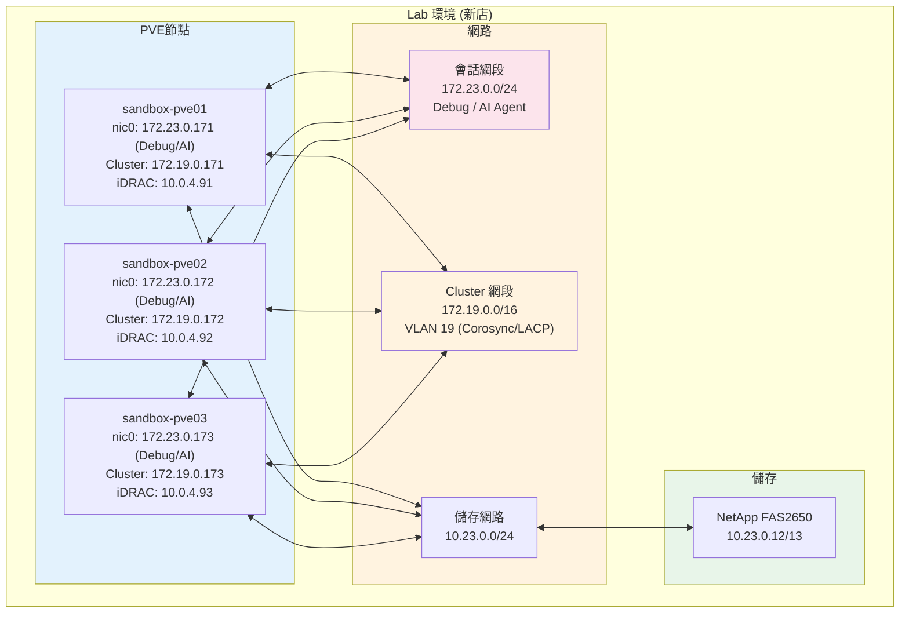

# 環境說明 (Environment Setup)

## 環境說明 (Environment Setup)

測試於 104 自行管理之資訊機房測試環境進行，設備與 PROD/STAGING/LAB 隔離，為獨立的 PoC 環境。

為確保測試完整度，本次測試環境將同時佈署於實體層與虛擬層，各維持至少3個以上的節點。

實體層硬體為 **3台 Dell R640 Rack-mount Server**
資源規格為：Intel(R) Xeon(R) Gold 6140 CPU @ 2.30GHz、768GB RAM
管理網路為 1Gbps、儲存網路為 10Gbps

虛擬層建構在 **3台 Dell R640 Rack-mount Server 搭建的 VMware 內**
硬體規格與實體層相同，單節點虛擬資源規格為：32 CPUs、256GB RAM
網路為 10Gbps x 2 (LACP static mode)

### 架構示意圖


實體層儲存架構為 Hypervisor 層直接存取後端 **NetAPP FAS2650** 儲存設備。
採用 NFS version 3、mount option 為: vers=3,soft,noatime,nodiratime

---

## 測試節點網路設定 (Test Node Network Configuration)

### 網段規劃

| 網段用途 | IP 範圍 | VLAN | 閘道器 | 備註 |
|----------|---------|------|--------|------|
| Agent 會話網段 (nic0) | 172.23.0.0/24 | - | - | SSH 管理用，不進行斷線測試 |
| PVE Cluster 網段 | 172.19.0.0/16 | 19 | 172.19.1.252 | Corosync/VM 流量，LACP 斷線測試區 |
| 儲存網路 (Storage) | 10.23.0.0/24 | - | - | NetApp 2650 封閉網段 |

### Sandbox 環境 (新店)

| 節點名稱 | iDRAC IP | PVE WebUI | nic0 (會話) | Cluster IP | 備註 |
|----------|----------|-----------|-------------|------------|------|
| sandbox-pve01 | 10.0.4.91 | 172.19.0.171:8006 | 172.23.0.171 | 172.19.0.171 |  |
| sandbox-pve02 | 10.0.4.92 | 172.19.0.172:8006 | 172.23.0.172 | 172.19.0.172 |  |
| sandbox-pve03 | 10.0.4.93 | 172.19.0.173:8006 | 172.23.0.173 | 172.19.0.173 |  |

### 網路介面說明

| 介面 | IP | 用途 | 斷線測試 |
|------|-----|------|----------|
| nic0 | 172.23.0.x | SSH 管理、Debug、AI Agent 與 LLM API 溝通 | 否（純備援溝通用途） |
| 集群網路 | 172.19.0.x | PVE Cluster、Corosync、LACP/bond0/bond1 故障轉移 | 是 |

> **重要**：nic0 (172.23.0.x) **不參與** PVE Cluster 也不用於 LACP/bond0/bond1 故障轉移，純粹用於 Debug 與 AI Agent 對外溝通。LACP/bond0/bond1 斷線測試在集群網段 (172.19.0.x) 進行。

## Corosync 雙 Ring 設計

| Ring | 網段 | 介面 | 用途 |
|------|------|------|------|
| ring0 | 172.19.0.x | vmbr0.19 (bond0) | 管理網路，Corosync 主要通訊 |
| ring1 | 10.23.0.x | bond2 | 儲存網路，Corosync 備援 |

**設計目的**：ring1 為 ring0 提供備援，單一 ring 故障不會導致叢集失效。

**測試影響**：
- bond0 雙鏈路故障不會導致叢集失效（因 ring1 備援）
- 真正測試 HA 觸發需同步阻斷 ring0 + ring1

---

## 網路架構示意圖 (Network Architecture)



---

## 網路 Bond 設定建議 (Network Bond Configuration)

### 目前環境網卡設定

> **現況**：nic0 (172.23.0.x) 僅用於 Debug 與 AI Agent 溝通，**不參與** PVE Cluster 或 LACP 故障轉移。LACP/bond0/bond1 斷線測試在集群網段 (172.19.0.x) 進行。

| 介面 | IP | 用途 | 備註 |
|------|-----|------|------|
| nic0 | 172.23.0.x | Debug、AI Agent 與 LLM API 溝通 | 斷線測試期間備援溝通 |
| 集群網路 | 172.19.0.x | PVE Cluster、Corosync、LACP | LACP/bond0/bond1 故障轉移測試區 |

### LACP 故障轉移測試矩陣

| 測試情境 | 測試對象 | 預期行為 | 驗證方式 | 優先序 |
|----------|----------|----------|----------|--------|
| nic0 斷線 (Cluster) | nic0 (172.19.0.x) | 流量中斷，測試期間可透過 172.23.0.x 溝通 | `ip link set down nic0` (需謹慎) | P1 |
| LACP bond0 單鏈路故障 | nic2 (bond0) | 流量自動切換至另一鏈路 | `ip link set down nic2` | P1 |
| LACP bond0 單鏈路故障 | nic3 (bond0) | 流量自動切換至另一鏈路 | `ip link set down nic3` | P1 |
| LACP bond0 雙鏈路故障 | nic2 + nic3 | 應觸發 HA 或進入唯讀模式 | `ip link set down nic2; ip link set down nic3` | P1 |
| LACP bond1 單鏈路故障 | nic4 (bond1) | 流量自動切換至另一鏈路 | `ip link set down nic4` | P1 |
| LACP bond1 雙鏈路故障 | nic4 + nic5 | NFS 儲存中斷，VM 可能凍住 | `ip link set down nic4; ip link set down nic5` | P2 |
| Corosync 管理網路隔離 | bond0 (管理網路) | 不應觸發 HA (需驗證) | `iptables` 阻斷通訊 | P1 |
| 管理網路中斷 | 會話網段 | VM 應持續運行，SSH 透過備援網段 | SSH 連線中斷測試 | P2 |

### 斷線測試期間的備援通訊

**重要**：進行 LACP/bond0/bond1 斷線測試時，所有節點仍可透過會話網段 (172.23.0.x) 正常溝通。

```bash
# 驗證 nic0 狀態 (會話網段)
ssh root@172.23.0.172 "ip a show nic0"

# 驗證 Cluster 網段狀態
ssh root@172.23.0.172 "ip a show | grep 172.19"

# 查看 Cluster 成員狀態
ssh root@172.23.0.172 "pvecm status"
```

---

## 儲存架構設定 (Storage Architecture)

### NetApp FAS2650 掛載資訊

```bash
# 掛載點範例
10.23.0.12:/svmAvol1    /mnt/pve/NA2650-nodeAvol1
10.23.0.12:/svmAvol2    /mnt/pve/NA2650-nodeAvol2
10.23.0.13:/svmBvol1    /mnt/pve/NA2650-nodeBvol1
10.23.0.13:/svmBvol2    /mnt/pve/NA2650-nodeBvol2
10.23.0.10:/volume2/pve-datastore  /mnt/pve/SSD-NAS

# 掛載參數
vers=3,soft,noatime,nodiratime
DISCARD enable (for thin provisioning)
```

### 儲存後端比較矩陣

| 儲存後端 | 格式支援 | Snapshot 支援 | 效能 | 適用場景 |
|----------|----------|---------------|------|----------|
| LVM-Thin | RAW | 原生 LVM Snapshot | 高 | 高效能 VM |
| NetApp NFS | QCOW2 | File Level Snapshot | 中 | 共享儲存、Snapshot 需求 |


---

## 硬體監控設定 (Hardware Monitoring)

### 建議監控指標

```bash
# CPU 監控
vmstat 1
top -b -n 1

# 記憶體監控
free -h
mcelog --client

# 網路監控
cat /proc/net/bonding/bond0
ip -s link show

# 儲存監控
lvs -o lv_name,data_percent,metadata_percent pve
pvesm status

# Corosync 監控
corosync-cmapctl | grep members
pvecm status
```

---

## 測試環境前置條件 (Test Environment Prerequisites)

### 必須完成項目

- [ ] 所有節點 iDRAC 網路連線正常
- [ ] PVE 9.1 已安裝並可透過 WebUI 存取
- [ ] Corosync 叢集已建立 (3 節點)
- [ ] NetApp FAS2650 NFS 已掛載
- [ ] `/etc/pve`、`/var/lib/pve-cluster` 已納入備份
- [ ] HA 機制已啟用 (如測試需要)

---

## 環境變更記錄 (Environment Change Log)

| 日期 | 變更項目 | 變更內容 | 負責人 |
|------|----------|----------|--------|
| 2026-03-20 | 補充網路架構 | 新增 Sandbox 環境網段規劃 | Tony |
| 2026-03-20 | 補充儲存資訊 | 新增 NetApp 掛載資訊 | Tony |
| 2026-03-20 | 補充監控設定 | 新增硬體監控指令 | Tony |

