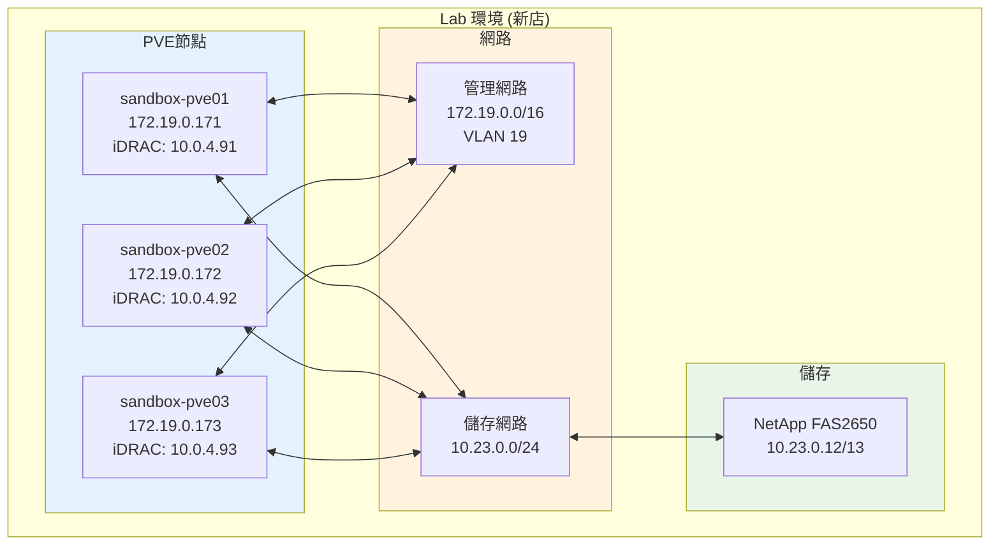

# 環境說明 (Environment Setup)

## 環境說明 (Environment Setup)

測試於 104 自行管理之資訊機房測試環境進行，設備與 PROD/STAGING/LAB 隔離，為獨立的 PoC 環境。

為確保測試完整度，本次測試環境將同時佈署於實體層與虛擬層，各維持至少3個以上的節點。

實體層硬體為 **3台 Dell R640 Rack-mount Server**
資源規格為：Intel(R) Xeon(R) Gold 6140 CPU @ 2.30GHz、768GB RAM
管理網路為 1Gbps、儲存網路為 10Gbps

虛擬層建構在 **3台 Dell R640 Rack-mount Server 搭建的 VMware 內**
硬體規格與實體層相同，單節點虛擬資源規格為：32 CPUs、256GB RAM
網路為 10Gbps x 2 (LACP static mode)

### 架構示意圖


實體層儲存架構為 Hypervisor 層直接存取後端 **NetAPP FAS2650** 儲存設備。
採用 NFS version 3、mount option 為: vers=3,soft,noatime,nodiratime

---

## 測試節點網路設定 (Test Node Network Configuration)

### Sandbox 環境 (新店)

| 節點名稱 | iDRAC IP | PVE WebUI | 管理網段 | 備註 |
|----------|----------|-----------|----------|------|
| sandbox-pve01 | 10.0.4.91 | 172.19.0.171:8006 | 172.19.0.0/16 (VLAN 19) |  |
| sandbox-pve02 | 10.0.4.92 | 172.19.0.172:8006 | 172.19.0.0/16 (VLAN 19) |  |
| sandbox-pve03 | 10.0.4.93 | 172.19.0.173:8006 | 172.19.0.0/16 (VLAN 19) |  |

### 網段規劃

| 網段用途 | IP 範圍 | VLAN | 閘道器 | 備註 |
|----------|---------|------|--------|------|
| 管理網路 (Mgmt) | 172.19.0.0/16 | 19 | 172.19.1.252 | PoC 網段 |
| 儲存網路 (Storage) | 10.23.0.0/24 | - | - | NetApp 2650 封閉網段 |

---

## 網路架構示意圖 (Network Architecture)



---

## 網路 Bond 設定建議 (Network Bond Configuration)

### LACP 設定

| Bond 介面 | 用途     | 模式           | 成員介面    | 備註           |
| --------- | -------- | -------------- | ----------- | -------------- |
| vmbr0     | VM 流量  | Trunking Port | bond0       | 依業務需求規劃 |
| vmbr0.19  | 管理網路 | VLAN ID | bond0      | MGMT、Corosync |
| bond0 | LACP | LACP (802.3ad) | nic2 + nic3 |  |
| bond2     | 儲存網路 | Access Port | nic4 + nic5 | NetApp 2650 |


### LACP 故障轉移測試矩陣

| 測試情境 | 預期行為 | 驗證方式 |
|----------|----------|----------|
| 單一鏈路中斷 | 流量自動切換至另一鏈路 | `ip link set down <interface>` |
| 交換器端故障 | 流量切換至備援交換器 | 實體拔除網路線 |
| Corosync 管理網路隔離 | 不應觸發 HA (需驗證) | `iptables` 阻斷通訊 |
| 管理網路中斷 | VM 應持續運行 | SSH 連線中斷測試 |

---

## 儲存架構設定 (Storage Architecture)

### NetApp FAS2650 掛載資訊

```bash
# 掛載點範例
10.23.0.12:/svmAvol1    /mnt/pve/NA2650-nodeAvol1
10.23.0.12:/svmAvol2    /mnt/pve/NA2650-nodeAvol2
10.23.0.13:/svmBvol1    /mnt/pve/NA2650-nodeBvol1
10.23.0.13:/svmBvol2    /mnt/pve/NA2650-nodeBvol2
10.23.0.10:/volume2/pve-datastore  /mnt/pve/SSD-NAS

# 掛載參數
vers=3,soft,noatime,nodiratime
DISCARD enable (for thin provisioning)
```

### 儲存後端比較矩陣

| 儲存後端 | 格式支援 | Snapshot 支援 | 效能 | 適用場景 |
|----------|----------|---------------|------|----------|
| LVM-Thin | RAW | 原生 LVM Snapshot | 高 | 高效能 VM |
| NetApp NFS | QCOW2 | File Level Snapshot | 中 | 共享儲存、Snapshot 需求 |


---

## 硬體監控設定 (Hardware Monitoring)

### 建議監控指標

```bash
# CPU 監控
vmstat 1
top -b -n 1

# 記憶體監控
free -h
mcelog --client

# 網路監控
cat /proc/net/bonding/bond0
ip -s link show

# 儲存監控
lvs -o lv_name,data_percent,metadata_percent pve
pvesm status

# Corosync 監控
corosync-cmapctl | grep members
pvecm status
```

---

## 測試環境前置條件 (Test Environment Prerequisites)

### 必須完成項目

- [ ] 所有節點 iDRAC 網路連線正常
- [ ] PVE 9.1 已安裝並可透過 WebUI 存取
- [ ] Corosync 叢集已建立 (3 節點)
- [ ] NetApp FAS2650 NFS 已掛載
- [ ] `/etc/pve`、`/var/lib/pve-cluster` 已納入備份
- [ ] HA 機制已啟用 (如測試需要)

---

## 環境變更記錄 (Environment Change Log)

| 日期 | 變更項目 | 變更內容 | 負責人 |
|------|----------|----------|--------|
| 2026-03-20 | 補充網路架構 | 新增 Sandbox 環境網段規劃 | Tony |
| 2026-03-20 | 補充儲存資訊 | 新增 NetApp 掛載資訊 | Tony |
| 2026-03-20 | 補充監控設定 | 新增硬體監控指令 | Tony |

